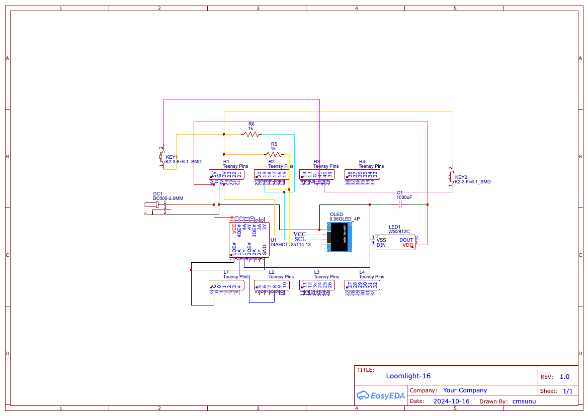

# The Loomlight 16 v1.0

This device attaches to your Louet Jane 16-shaft loom and lights up the shafts you are meant to toggle next. It takes .wif files onto an SD card, and you select the file on boot.

Levers that should be down are shown in blue/green. Levers that should be up are shown in white. Levers that were previously down in the last pick but should now be up be up are shown in red/orange.

The files save your position on the SD card in a special .wifdata file, allowing the loomlight to automatically pick up where you left off.

The Loomlight 16 is built with a Teensy 4.1 and WS2811 LEDs.

This repo contains code, .obj files, and a diagram for wiring the Teensy.

## Design Issues
There are a few non-breaking design issues in this version of the Loomlight.
- The enclosure for the OLED screen bumps against the middle levers when they are toggled in the downward position. This does not interfere with weaving, but does lightly flex the loomlight in a way that may eventually require repair.
- Long text will not appear on the screen due to size, which results in cut-off text when the .wif file indicates a pick with many shafts. The same goes for .wif files with long names. I mostly use this screen to confirm that the pick is advancing and to check the number of the pick, which appears without issue.

## Materials
In addition to what is available in the repo, you will need:
- [Teensy 4.1](https://www.pjrc.com/store/teensy41.html)
- 74AHCT125 level shifter (such as the one [here](https://www.adafruit.com/product/1787))
- 128x32 OLED screen with I2C connection (something like [this](https://www.amazon.com/Teyleten-Robot-Display-SSD1306-Raspberry/dp/B08ZY4YBHL) is likely to work)
- Buttons (we used ones we had lying around, but I suspect [these](https://www.amazon.com/dp/B07P25F2DL) will work)
- A 3cm x 7cm protoboard, the type with a hole drilled in each corner
- 2 x Female Headers (24 pins long)
- Wires and Solder
- [Barrel Jack Power Connector](https://www.amazon.com/Socket-Threaded-Connector-Adapter-Dustproof/dp/B08SJM2G52)
- Barrel Jack Power 5v

## Wiring

